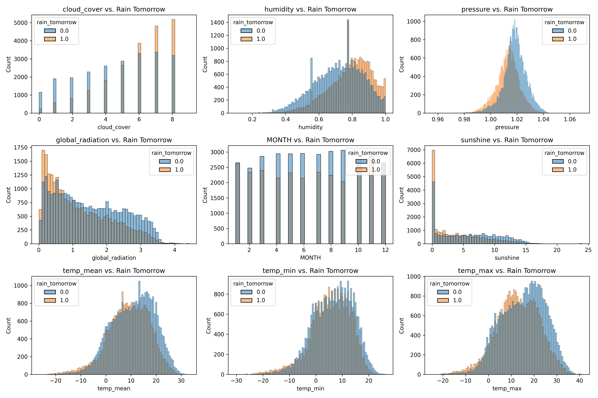
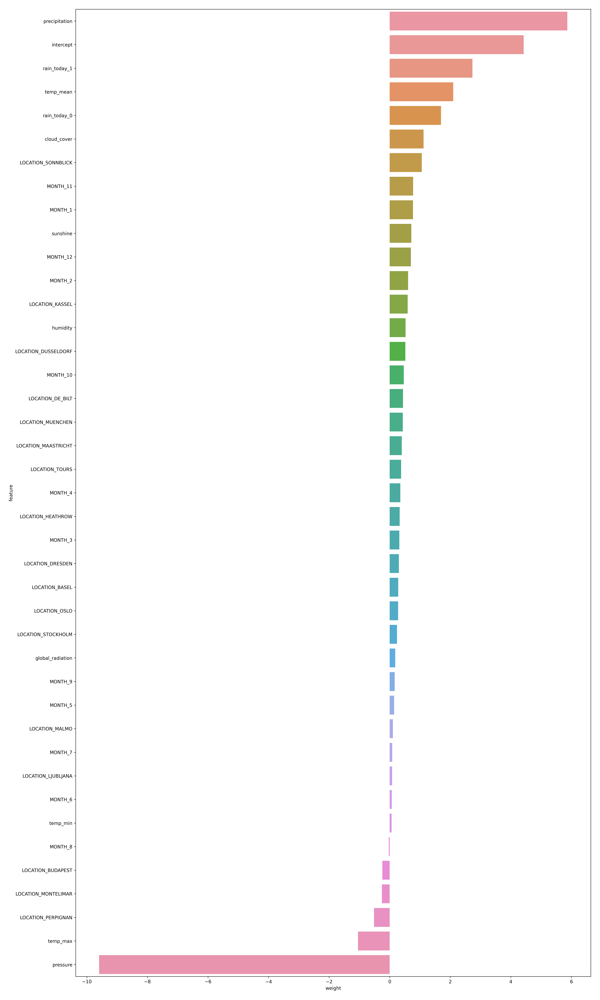
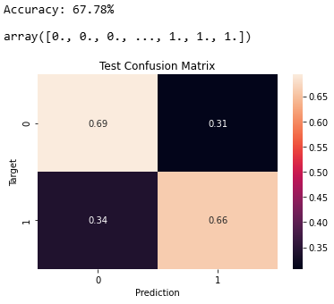

# Logistic Regression on European Weather Data from Kaggle 🌧️🌍

## Table of Contents 📚
1. [Introduction](#introduction)
2. [Reshaping the DataFrame + Some Exploratory Data Analysis](#reshaping-the-dataframe--some-exploratory-data-analysis)
3. [Preprocessing](#preprocessing)
4. [Training a Logistic Regression Model](#training-a-logistic-regression-model)
5. [Evaluating the Model and Making Predictions](#evaluating-the-model-and-making-predictions)
6. [Saving the Trained Model](#saving-the-trained-model)
7. [Conclusion](#conclusion)
8. [How to Run](#how-to-run)

## Introduction 🌦️
In this project, we predict whether it will rain tomorrow based on weather data from multiple European cities from 2000-2010. The dataset contains various weather variables such as temperature, humidity, pressure, cloud cover, and more. We use a Logistic Regression model to classify whether it will rain the following day, utilizing the given weather features.

## Reshaping the DataFrame + Some Exploratory Data Analysis 🔄📊
The dataset initially comes in a wide format, where each weather variable for each city is represented as its own column—for example, `BASEL_cloud_cover`, `BUDAPEST_temp_mean`, `DRESDEN_precipitation`, and so on. This structure makes it difficult to analyze or model data across locations in a unified way.

To address this, the DataFrame is reshaped into a long format, where each row represents the weather data for a single location on a specific date. Here's how the transformation works:

- The city name is extracted from each column and stored in a new column called `LOCATION`.
- The weather variables (`cloud_cover`, `humidity`, `pressure`, `global_radiation`, `precipitation`, `sunshine`, `temp_mean`, `temp_min`, `temp_max`) are standardized into their own columns.
- The original `DATE` and `MONTH` columns are retained, and the new `LOCATION` column is placed just after `MONTH`.

Here's a visual representation of the distribution of various weather variables in relation to whether it rained the next day:

From these histograms, we can start to observe relationships between certain weather variables and the likelihood of rain the next day. For instance, higher atmospheric pressure appears to be associated with a lower chance of rain tomorrow, while lower pressure often coincides with rainy conditions. Additionally, the summer months show a greater tendency for rain, suggesting seasonal patterns in precipitation. Interestingly, higher maximum temperatures also seem to increase the probability of rain the following day.

## Preprocessing 🧹
Before training the model, we preprocess the data by handling missing values, encoding categorical variables (like `MONTH`), and scaling numerical features. We use the `SimpleImputer` from `sklearn` to fill in missing values and the `OneHotEncoder` to convert categorical features into numerical ones.

After this, we split the dataset into training, validation, and test sets. This allows us to train our model on one set, validate it on a separate set, and test its final performance on a completely unseen set of data.

## Training a Logistic Regression Model 🎓
A Logistic Regression model is trained using the preprocessed data. The model is trained to predict the probability of rain the next day based on the weather features.

The model is trained using the `LogisticRegression` class from `sklearn`, with the solver set to `'liblinear'`. 

The bar plot below visualizes the weights (coefficients) assigned by the logistic regression model to each feature, indicating their influence on the prediction.

## Evaluating the Model and Making Predictions 📈
Once the model is trained, we evaluate its performance on the validation and test datasets. The accuracy is calculated for each set, and the confusion matrix helps to understand the classification performance (i.e., the number of true positives, false positives, true negatives, and false negatives).

The accuracy of the model is approximately 67.78%. The model shows consistent performance across the training, validation, and test datasets, indicating that it is not overfitting and generalizes well to unseen data. It also outperforms a random model (50%) as well as a naive model that always predicts "No" (i.e., no rain tomorrow) (53%).

## Saving the Trained Model 💾
After training the model, we save it to a file using `joblib`. This allows the model to be reused later without the need to retrain it, enabling faster predictions on new data.

